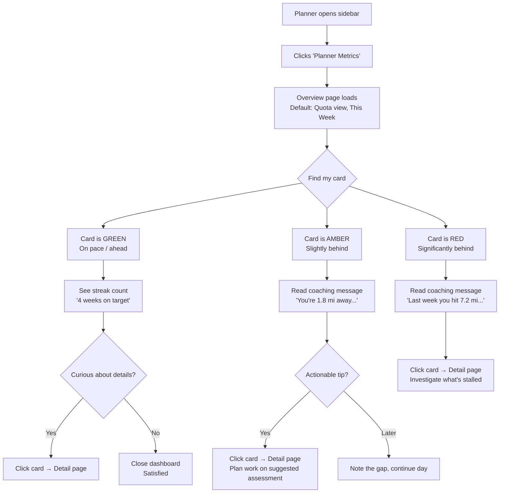
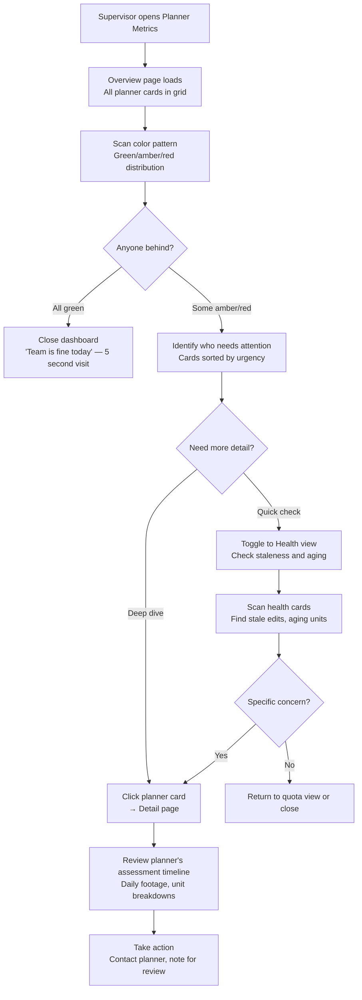
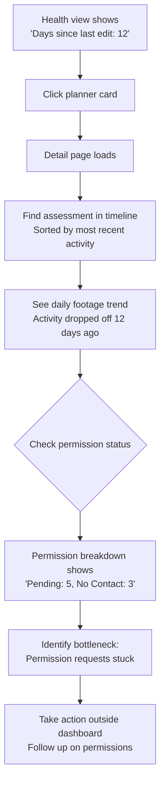

# UX Design Specification — Planner Metrics Dashboard

**Author:** Arbman
**Date:** 2026-02-14
**Feature:** Planner Metrics — Overview Cards + Deep-Dive Detail Page

---

## Executive Summary

### Project Vision

The Planner Metrics Dashboard adds a new "Planner Metrics" section to the WS-TrackerV1 sidebar, providing individual planner performance profiles and team-wide visibility. The feature surfaces career ledger data — already collected and stored locally in PostgreSQL via the PlannerCareerLedgerService — through two connected views:

1. **Overview Page (Phase 1)** — A card grid showing all planners with at-a-glance KPIs, defaulting to the current week's quota progress. Cards are clickable entry points to individual detail pages.
2. **Detail Page (Phase 2)** — A comprehensive single-planner view with assessment history, daily footage trends, unit breakdowns, quota tracking, and contribution analysis. Supports drilling into historical scope years.

The primary metric anchor is the **6.5 miles/week quota** — every planner's progress is measured against this benchmark. The system serves both planners (self-tracking, personal motivation) and supervisors (team oversight, outlier detection, workload balancing).

**Data path:** Card metrics are served from **local PostgreSQL** (`planner_career_entries` table with JSONB `daily_metrics`), not through the WorkStudio API pipeline. Detail page data requires deeper aggregation queries but remains local. This is a distinct data path from the existing `CachedQueryService` → `GetQueryService` → API flow.

### Target Users

**Planner (Forester)**
- Views their own profile to track weekly quota progress
- Wants to see which assessments they've worked, their daily footage trend, and their contribution to shared circuits
- Motivated by visible progress — streaks, milestones, quota achievement
- Thinks in terms of "this week" and "this month," not scope years
- Tech comfort: moderate (field workers using tablets/laptops)
- Primary device: desktop browser (office), occasional tablet (field)

**Supervisor / Manager**
- Scans all planner cards to spot who's on track vs. falling behind
- Drills into individual planners to understand patterns (rework rate, region spread, assessment load)
- Needs quick comparison without explicit "ranking" that feels punitive
- May take actions in the future (assign work, flag for review) — exact actions TBD
- Primary device: desktop browser

**Admin**
- System-wide visibility across all planners and regions
- Already has Data Management tools; Planner Metrics complements with people-focused view

### Key Design Challenges

1. **Dual-persona card design** — The same planner card must serve a planner's self-tracking needs (encouragement, personal progress) and a supervisor's scanning needs (comparison, outlier detection). Card hierarchy must prioritize the most universally useful metrics.

2. **Emotional quota visualization** — The 6.5 mi/week quota drives three emotional states on every card:
   - **On pace or ahead** — celebratory but not obnoxious (green/success accents, upward trend)
   - **Slightly behind** — encouraging, not alarming ("You're 1.2 mi away from your weekly goal")
   - **Significantly behind** — honest but constructive (show the path back, not just the gap)

3. **Time-based default, not scope-year** — Planners think in "this week" and "this month." The default view should be time-based (current week's quota) with scope year as a secondary filter for deeper analysis. Period toggle: `week | month | year | scope-year`.

4. **Scalable grid layout (4-16 planners)** — At 4 planners the grid must not feel empty; at 16 it must not feel cramped. Responsive breakpoints need to handle this range gracefully.

5. **Progressive disclosure on detail page** — Career ledger data is extremely deep (assessments with daily metrics, station-level geo, unit breakdowns, contribution ratios, rework details). The detail page must guide users through layers of depth without overwhelming.

6. **Overview-to-detail transition** — The transition from card to detail page shapes the information architecture. Options: hard page navigation (new route) vs. slide-in panel (existing pattern with region cards). Decision impacts component structure.

### Design Opportunities

1. **Quota streak / momentum tracking** — Consecutive weeks meeting the 6.5 mi quota creates a natural gamification hook. "5-week streak" is more motivating than raw totals and requires no new infrastructure.

2. **Contribution storytelling** — The `total_contribution` and `others_total_contribution` fields uniquely show how a planner fits into team effort on shared assessments. No other system surfaces this. Must be presented as "belonging" not "surveillance."

3. **Status-aware timeline** — The `assumed_status` field on daily metrics (Active/QC/Rework/Closed) enables lifecycle visualization per assessment — when rework happened, how long QC took, etc.

4. **Future gamification foundation** — Leaderboards, badges, and rankings are planned. The card and detail page design should anticipate these without implementing them now (e.g., sortable card grid, placeholder for rank indicators).

### Implementation Phasing

| Phase | Scope | Data Source |
|-------|-------|-------------|
| **Phase 1** | Overview page with planner cards, quota status, period toggle | PostgreSQL `planner_career_entries` JSONB aggregation |
| **Phase 2** | Detail page with assessment timeline, unit breakdowns, contribution analysis | PostgreSQL deeper queries + lazy loading |
| **Design now** | Both phases designed together for consistent IA, but Phase 2 built separately |

### Party Mode Review Notes (2026-02-14)

Key refinements from multi-agent discussion (Sally/UX, John/PM, Winston/Architect):
- Default time frame changed from scope-year to **current week** (quota-centric)
- Three emotional states for quota visualization added to design challenges
- Phase 1/Phase 2 split acknowledged — cards overview first, detail page second
- Data path clarified: **local PostgreSQL**, not WS API pipeline
- New `PlannerMetricsService` needed (Eloquent-based, not `CachedQueryService`)

## Core User Experience

### Defining Experience

The core interaction loop is **"Check quota, check health, dig deeper."**

1. **Check quota** — Planner or supervisor opens the overview page. Every card shows weekly quota progress at a glance. In under 2 seconds, you know who's on track and who's not.
2. **Check health** — Page-level toggle switches ALL cards to active assessment health view simultaneously. See progress (miles + permission statuses), oldest pending unit age, and days since last edit. Enables cross-planner comparison in a single scan.
3. **Dig deeper** — Click any card to navigate to the planner's full detail page. Assessment timeline, daily trends, unit breakdowns, contribution analysis.

### Card View Toggle (Page-Level)

The overview page has a **single page-level toggle** that switches all cards between two views simultaneously. This is NOT a per-card toggle.

**Rationale:** The primary scan pattern is "all planners, one question at a time." A supervisor asks "who's behind on quota?" (scan all in quota mode), then "who has stale work?" (switch all to health mode). Per-card toggles break the comparison pattern.

**Implementation:** Single Livewire property `#[Url] public string $cardView = 'quota'` — URL-bookmarkable, no Alpine.js needed.

**Face A — Quota View:**

| Priority | Metric | Source |
|----------|--------|--------|
| 1 | Weekly miles vs 6.5 target | `planner_career_entries.daily_metrics` JSONB aggregation |
| 2 | Streak count (consecutive weeks on target) | Computed from daily_metrics weekly rollups |
| 3 | Active assessment count | `planner_job_assignments` count |
| 4 | Scope-year total miles (when in year/scope period) | `planner_career_entries` sum |

**Face B — Active Health View:**

| Priority | Metric | Source |
|----------|--------|--------|
| 1 | Oldest pending unit (days) | `assessment_monitors.daily_snapshots` → `aging_units` |
| 2 | Days since last edit | `assessment_monitors.daily_snapshots` → `planner_activity.days_since_last_edit` |
| 3 | Assessment progress (miles + % complete) | `assessment_monitors.daily_snapshots` → `footage` |
| 4 | Permission breakdown (Approved/Pending/No Contact/Refused/Deferred/PPL Approved) | `assessment_monitors.daily_snapshots` → `permission_breakdown` |

**Sort changes per view:**
- Quota view: sort by miles behind quota (most behind first)
- Health view: sort by days since last edit (most stale first), then oldest pending unit

**Zero active assessments edge case:** When a planner has no active assessments (between scope years, or all closed), the Health face shows a "No active assessments" state — compact, non-alarming, with their last active date. The toggle still works but the card collapses to a minimal layout in health mode.

**Data bridge:** `planner_job_assignments.job_guid` links planners to `assessment_monitors.job_guid` for health data. The `PlannerMetricsService` needs two methods:
- `getQuotaMetrics(string $plannerUsername, string $period): array`
- `getHealthMetrics(string $plannerUsername): array`

### Platform Strategy

- **Primary platform:** Desktop browser (Chrome/Edge), responsive down to tablet
- **Input mode:** Mouse/keyboard — no touch-specific interactions needed
- **No offline requirement** — dashboard always requires live database access
- **Leverages existing stack:** Livewire 4 for reactivity, Alpine.js for client-side interactions, DaisyUI for theme-consistent components
- **Data sources:** Local PostgreSQL only (no WS API calls at render time)
  - `planner_career_entries` JSONB → quota, career metrics, daily footage
  - `assessment_monitors` JSONB → active assessment health snapshots
  - `planner_job_assignments` → bridge between planners and active assessments
- **New service:** `PlannerMetricsService` (Eloquent-based aggregation) — distinct from `CachedQueryService`

### Effortless Interactions

| Interaction | Target | How |
|---|---|---|
| See quota status | Zero clicks from overview | Card Face A: prominent weekly miles vs 6.5 target with color-coded state |
| See active assessment health | One click (page toggle) | Page-level toggle switches all cards to Face B simultaneously |
| Compare planners | Zero effort after toggle | All cards in same view mode — scan the color pattern |
| Jump to planner detail | One click | Card click → full detail page route (new page, not panel) |
| Switch time period | One click | Period toggle in page header: week / month / year / scope-year |
| Identify struggling planners | Zero effort | Auto-sort by "needs attention" — sort criteria changes per active view |

**Automatic behaviors (no user action required):**
- Cards highlight planners below quota with `warning` or `error` accent (DaisyUI semantic colors)
- "Days since last edit" shows `error` state when exceeding threshold (configurable, default 7 days)
- "Oldest pending unit" shows age in days with `warning` when past threshold (14 days per config)
- Default sort: planners needing attention first (quota view: behind quota; health view: stale → aging → on track)

### Critical Success Moments

1. **"I can see my whole team in 3 seconds"** — Supervisor opens the page. Grid of cards. Color-coded quota states. Immediately knows who needs attention. No scrolling, no clicking. This is the make-or-break moment.

2. **"My number is right"** — Planner sees their weekly miles on their card. It matches their mental model of what they did this week. If this number is ever wrong or stale, trust in the entire system is destroyed. Data freshness is paramount.

3. **"I didn't know my units were stuck"** — Supervisor toggles to health view. Sees one planner with "oldest pending: 18 days." Clicks through to detail page. Realizes permission requests are bottlenecked. This is the "aha" moment that makes the health toggle worth building.

4. **"I'm on a streak"** — Planner sees "4 weeks on target." Simple. Motivating. Creates a behavioral loop — they want to keep the streak alive. This is the gamification seed.

### Experience Principles

1. **Quota is the heartbeat** — The 6.5 mi/week quota is the primary visual anchor on every card. All other metrics orbit around it. If you only see one number, it's quota progress.

2. **Two faces, one page** — Career/quota and active health are equal citizens, surfaced via page-level toggle. Neither is buried in a detail page. The overview IS the dashboard — the detail page is for investigation, not monitoring.

3. **Color tells the story** — DaisyUI semantic colors (success/warning/error) carry meaning instantly. A supervisor scanning 16 cards reads the color pattern before any numbers. No hardcoded colors — theme-driven.

4. **Stale data is worse than no data** — Every metric that can go stale (last edit, pending units, quota) has a visible freshness indicator. If data hasn't been updated, show when it was last refreshed.

5. **Compare, then investigate** — Overview is for pattern recognition across all planners (page-level toggle enables this). Detail page is for root cause analysis on one planner. Don't mix the two.

### Party Mode Review Notes — Round 2

Key refinements from multi-agent discussion (Sally/UX, Mary/Analyst, Winston/Architect):
- Toggle changed from **per-card** to **page-level** — better for comparison, simpler state
- Sort criteria changes per active view (quota: miles behind; health: staleness)
- Zero active assessments edge case handled with graceful fallback state
- Data bridge identified: `planner_job_assignments.job_guid` → `assessment_monitors.job_guid`
- `PlannerMetricsService` needs `getQuotaMetrics()` + `getHealthMetrics()` methods

## Desired Emotional Response

### Primary Emotional Goals

| User | Primary Emotion | Supporting Emotion |
|------|----------------|-------------------|
| **Planner** | **Oriented & Motivated** — "I know exactly where I stand and what to do next" | Pride in streaks, belonging in contribution |
| **Supervisor** | **Informed Confidence** — "I know where to focus my attention today" | Trust in data accuracy, calm efficiency |
| **Both** | **Supported, not surveilled** — The tool is a coach, not a judge | Curiosity to explore deeper (detail page pull) |

### Emotional Journey Mapping

| Moment | Desired Emotion | Design Implication |
|--------|----------------|-------------------|
| **Opening overview** | Oriented, grounded | Card grid loads instantly with clear color-coded states. No loading spinner anxiety. Planner's own card is visually findable within 1 second. |
| **On pace / ahead of quota** | Quiet pride, momentum | Success color accents. Streak count prominent. "Keep it going" energy without fireworks. |
| **Slightly behind quota** | Coached, encouraged | Warm warning tone (amber, not red). Coaching message: "You're 2.1 mi away — a strong Wednesday gets you there." Tip: suggests which active assessment has the most remaining miles to target. |
| **Significantly behind quota** | Honest but constructive | Clear deficit shown, but paired with actionable context: "3 active assessments available" or "Last week you hit 7.2 mi — this pace is recoverable." Never punitive language. |
| **Supervisor scanning grid** | Informed confidence | Color pattern recognition in < 3 seconds. Warning cards draw the eye without creating panic. Sort by "needs attention" removes the need to mentally triage. |
| **Toggling to health view** | Diagnostic curiosity | Slight tone shift — clinical but not cold. "Let's check what's stuck." Health metrics use info/warning colors, not success/error. Feels like opening a different lens on the same team. |
| **Seeing a streak** | Personal achievement + team visibility | Streak is visible on the card to everyone (team recognition) but feels like a personal milestone. Small, tasteful — not a leaderboard. Future: badges, milestones. |
| **Something is stuck (aging units, stale edits)** | Urgency to act, not alarm | Warning state with clear "what to do" implication. "Oldest pending: 18 days" is a nudge, not a siren. Detail page explains which assessment and which stations. |
| **Zero active assessments** | Calm, not anxious | "No active assessments" state is neutral — not an error. Shows last active date. Planner between assignments shouldn't feel like they're failing. |
| **Returning to dashboard** | Anticipation | "Did my number go up?" The streak and quota create a behavioral pull — planners want to check in. This is the habit loop. |

### Coaching System Design

The behind-quota coaching messages are contextual tips, not generic platitudes. They use the planner's actual data to suggest next steps.

**Coaching Message Types:**

| Condition | Message Pattern | Example |
|-----------|----------------|---------|
| Slightly behind (< 2 mi gap) | Encouraging + achievable framing | "You're 1.8 mi away — that's a solid day on Kinzer 69 (12.4 mi remaining)" |
| Significantly behind (> 3 mi gap) | Historical comparison + recovery path | "Last week you hit 7.2 mi. Two strong days would close the gap." |
| Behind + stale edits | Gentle nudge toward action | "Your last edit was 4 days ago. Picking up where you left off on Central circuits?" |
| On pace + active assessments progressing | Positive reinforcement + next target | "On track this week. Harrisburg circuit is 68% complete — strong close candidate." |
| Streak milestone | Celebration moment | "5 weeks on target! Your longest streak this scope year." |

**Coaching rules:**
- Messages reference the planner's actual assessments and metrics (not generic)
- Never compare a planner to other planners in the coaching message (that's surveillance)
- Tips suggest which assessment to focus on based on remaining miles and progress %
- Tone is peer-to-peer ("a strong Wednesday gets you there"), not managerial ("you need to improve")
- Messages rotate to avoid staleness — don't show the same tip two days in a row

### Micro-Emotions

| Micro-Emotion | Where It Matters | Design Response |
|--------------|-----------------|-----------------|
| **Confidence vs. Confusion** | Reading the card for the first time | Metrics hierarchy is consistent and learnable. Quota is always top-left. No abbreviations without context. |
| **Trust vs. Skepticism** | Seeing the weekly number | "Last updated: today 6:00 AM" timestamp visible. If data is stale, say so — never hide it. |
| **Accomplishment vs. Frustration** | End of a good week | Streak increments. Card shifts to success state. The system notices and reflects it. |
| **Belonging vs. Isolation** | Contribution data on detail page | "You contributed 30% of this assessment alongside 3 others" — frames work as collaborative. |
| **Curiosity vs. Overwhelm** | Detail page depth | Progressive sections with clear headers. Collapsed by default. User controls how deep they go. |

### Emotions to Avoid

| Emotion | Trigger | Prevention |
|---------|---------|------------|
| **Surveillance anxiety** | Dashboard feels like a manager watching over your shoulder | Coaching tone, no planner-to-planner comparisons on cards, no rankings (yet) |
| **Data distrust** | Number doesn't match planner's mental model | Show data source + freshness. Allow planner to drill into the daily breakdown that produced the number. |
| **Information overload** | Too many metrics on the card | Two-face toggle keeps each view focused. Max 4 metrics per face. |
| **Shame** | Card prominently shows failure state | Behind-quota cards use amber/warning, not red/error. Coaching message provides a path forward. |
| **Apathy** | Dashboard doesn't change or feel alive | Streak counter, coaching messages, and daily-updating metrics create a "living" feel. |

### Emotional Design Principles

1. **Coach, don't judge** — Every behind-quota state pairs the deficit with an actionable suggestion. The dashboard is a teammate, not a scoreboard.

2. **Celebrate quietly** — Streaks and on-pace states use success colors and small indicators, not confetti or animations. Pride should feel earned, not manufactured.

3. **Honesty builds trust** — Show data freshness timestamps. If something is stale or missing, say so. Never hide a gap — users will notice and lose trust.

4. **Warmth in the warnings** — Amber before red. Coaching before criticism. "You're 2.1 mi away" before "below quota." The first framing a planner sees should be the encouraging one.

5. **Curiosity over obligation** — The detail page should feel like "I want to see more" not "I have to check this." Progressive disclosure, collapsible sections, interesting data (contribution %, lifecycle timelines) that rewards exploration.

## UX Pattern Analysis & Inspiration

### Inspiring Products Analysis

Three product categories inform the Planner Metrics Dashboard design, each contributing a distinct UX strength:

**1. Fitness/Activity Trackers (Strava, Apple Fitness, Garmin Connect)**

| What They Nail | How It Applies |
|---|---|
| **Ring/progress visualization** | Apple Fitness rings = weekly quota progress. Circular or linear progress toward 6.5 mi with clear "gap remaining" is immediately legible. |
| **Coaching messages** | "You're 2 mi from your goal — a brisk walk would do it." Tone is encouraging, specific, achievable. Our coaching messages follow this exact pattern. |
| **Weekly summary cards** | End-of-week summary with comparison to previous weeks. Provides context without judgment. Inspires our period toggle (week/month/year). |
| **Activity streaks** | "7-day move streak!" Small, visible, motivating. Does not punish when broken — just resets. No shame, just "start a new one." |
| **Behind-pace warmth** | Apple Fitness uses amber tones, not red. "You usually do more by this time." Factual, not critical. |

**Key UX pattern:** Progress toward a known target is the primary visual. Everything else orbits it.

**2. Sales Team Dashboards (HubSpot, Salesforce)**

| What They Nail | How It Applies |
|---|---|
| **Team card grid** | Rep cards showing pipeline value, deal count, activity score. Supervisor scans 10-20 cards and knows the team state. Directly maps to our planner card grid. |
| **Color-coded status** | Green/amber/red pipeline health indicators. Pattern recognition in under 3 seconds. Supervisors read the color before the numbers. |
| **Drill-down from card** | Click a rep's card → full pipeline detail. The card is the entry point, not the destination. Same as our card → detail page pattern. |
| **Sortable/filterable grid** | Sort by "least active," "lowest pipeline," "most deals." Our sort-per-view (quota: miles behind; health: staleness) follows this pattern. |
| **Health metrics alongside performance** | Pipeline health (stale deals, aging opportunities) shown alongside revenue metrics. Maps to our quota face + health face toggle. |

**Key UX pattern:** The grid IS the dashboard. Each card is a self-contained status report. Supervisors scan, don't search.

**3. Duolingo (Gamification & Retention)**

| What They Nail | How It Applies |
|---|---|
| **Streak as primary motivator** | The streak counter is THE retention hook. Users open the app just to maintain it. Our weekly quota streak serves the same purpose. |
| **Gentle loss aversion** | "Don't lose your 14-day streak!" — framed as protecting something you've built, not as punishment. Our coaching for behind-quota planners should feel like protecting momentum. |
| **Contextual tips** | "Pro tip: practice for just 5 minutes to keep your streak." Achievable, specific. Our coaching tips suggest specific assessments to work on. |
| **Milestone celebrations** | "10-day streak! You're on fire!" Small, tasteful, earned. Not overdone. Future gamification foundation for our badges/milestones. |
| **Daily check-in habit** | The app creates a reason to come back every day. Our daily-updating quota progress + coaching messages create the same pull. |
| **No shame on failure** | Streak breaks quietly reset. No "you failed" screen. Just "start a new streak today." Our zero/behind-quota state follows this principle. |

**Key UX pattern:** Small, frequent wins build habits. The streak is a promise to yourself, not a metric for others.

### Transferable UX Patterns

**Navigation Patterns:**

| Pattern | Source | Application |
|---------|--------|-------------|
| Card grid as primary view | HubSpot/Salesforce | Overview page is a grid of planner cards — no list view needed initially |
| Page-level view toggle | Salesforce (pipeline/forecast toggle) | Quota view ↔ Health view toggle switches all cards simultaneously |
| Card → detail drill-down | All three sources | Click card → full page route (not modal or panel) |
| Period selector in header | Strava (This Week / This Month / This Year) | Period toggle: week / month / year / scope-year |

**Interaction Patterns:**

| Pattern | Source | Application |
|---------|--------|-------------|
| Progress ring/bar as hero metric | Apple Fitness | Weekly miles toward 6.5 quota is the dominant card element |
| Streak counter with quiet celebration | Duolingo | "4 weeks on target" shown on card — small badge, not fireworks |
| Smart sort by "needs attention" | HubSpot | Default sort puts behind-quota or stale planners first |
| Coaching tooltip/message | Apple Fitness + Duolingo | Contextual tip beneath the quota progress, referencing actual assessment data |

**Visual Patterns:**

| Pattern | Source | Application |
|---------|--------|-------------|
| Semantic color coding (green/amber/red) | All three | DaisyUI success/warning/error mapped to quota states |
| Compact card with 3-4 key metrics | HubSpot | Max 4 metrics per card face — no data overload |
| Activity heatmap / sparkline | Strava / GitHub | Detail page: daily footage sparkline across the week/month |
| Progress percentage with context | Apple Fitness | "4.3 / 6.5 mi (66%)" — raw + target + percentage |

### Anti-Patterns to Avoid

| Anti-Pattern | Source | Why to Avoid |
|---|---|---|
| **Leaderboard as default view** | Salesforce gamification plugins | Ranks planners against each other on first view — creates surveillance anxiety. Save for opt-in future feature. |
| **Red/error color for any behind state** | Generic dashboards | Red = alarm = shame. Use amber/warning for "slightly behind," reserve error state for critical health issues (stale > 14 days). |
| **Notification spam** | Duolingo push notifications | "You haven't practiced today!" repeated 3x is annoying. Our coaching messages appear on the card when viewed — no push notifications. |
| **Dense data tables as primary view** | Salesforce classic | Tables are for power users drilling deep. The card grid is the primary view. Table view is a future option, not default. |
| **Streak guilt** | Some fitness apps | "You lost your 30-day streak" with a sad icon. Our streak resets quietly — "Start a new streak" is the only message. |
| **Delayed data loading** | Dashboard tools with skeleton screens everywhere | PostgreSQL queries are fast. Cards should render fully on page load. Skeleton screens signal "this is slow" — avoid if possible. |

### Design Inspiration Strategy

**Adopt directly:**
- Progress bar/ring toward known quota target (Apple Fitness) — this IS the card's hero element
- Streak counter with quiet milestone celebration (Duolingo) — proven retention mechanic
- Card grid with color-coded status scanning (HubSpot) — proven supervisor pattern
- Period selector in page header (Strava) — natural time navigation

**Adapt for our context:**
- Coaching messages (Apple Fitness + Duolingo) — adapt to reference specific assessments, regions, and miles remaining. Our coaching is data-driven, not template-based.
- Sort by "needs attention" (HubSpot) — adapt sort criteria per active view face (quota: miles behind; health: staleness)
- Drill-down from card (all sources) — adapt as full page navigation (not modal) since detail page has deep data

**Avoid:**
- Leaderboards/rankings as default (save for future gamification opt-in)
- Push notifications or notification badges for behind-quota
- Red/error states for normal behind-quota (amber/warning only)
- Data tables as primary view (cards first, tables as future power-user option)
- Streak guilt messaging on break

## Design System Foundation

### Design System Choice

**DaisyUI v5 + Tailwind CSS v4** — extending the existing design system already in use across WS-TrackerV1.

This is not a new design system selection but a deliberate decision to leverage and extend the established component patterns. The Planner Metrics Dashboard introduces new card variants (quota card, health card) and interaction patterns (page-level toggle, coaching messages) that build on DaisyUI's semantic component library.

### Rationale for Selection

| Factor | Decision Driver |
|--------|----------------|
| **Consistency** | Every existing page (Dashboard Overview, Data Management, User Management) uses DaisyUI components. A different system would fragment the UI. |
| **Theme support** | DaisyUI's semantic color tokens (`success`, `warning`, `error`, `info`) map directly to the emotional states defined in Step 4 — quota on-pace, behind, and critical. |
| **Speed** | No new dependencies to install, no new patterns to learn. Solo developer + AI agents can ship faster by extending known patterns. |
| **Accessibility** | DaisyUI components include ARIA attributes and keyboard navigation by default. |
| **Dark mode ready** | Theme switching already works via `$store.theme` Alpine store. New components inherit this automatically. |

### Implementation Approach

**Extend, don't reinvent.** The Planner Metrics Dashboard creates 3 new component patterns that layer on top of existing DaisyUI primitives:

| New Component | Built From | New Behavior |
|---|---|---|
| **Planner Quota Card** | DaisyUI `card` + `stat` + `progress` | Combines progress bar, stat values, streak badge, and coaching message in a compact card layout |
| **Planner Health Card** | DaisyUI `card` + `stat` + `badge` | Permission breakdown badges, aging indicators, staleness warning states |
| **Page-Level Toggle** | DaisyUI `btn-group` or `tabs` | Single toggle in page header that switches all cards between quota and health views |

**Component hierarchy:**
- Livewire page component (`PlannerMetrics/Overview.php`) manages state (`$cardView`, `$period`)
- Blade partial for each card face (`_quota-card.blade.php`, `_health-card.blade.php`)
- DaisyUI utility classes for all styling — no custom CSS files

### Customization Strategy

**Theme tokens (no changes needed):**
- `success` → on-pace / ahead of quota (green family)
- `warning` → slightly behind quota (amber family)
- `error` → critical health issues only (stale > 14 days, significantly behind)
- `info` → neutral health metrics, informational states

**Custom extensions (Tailwind utilities only):**
- Coaching message component: `bg-base-200` with `text-base-content` — neutral container that doesn't compete with status colors
- Streak badge: DaisyUI `badge badge-sm` with dynamic color based on streak length
- Progress toward quota: DaisyUI `progress` component with semantic color class (`progress-success`, `progress-warning`)
- Sparkline (detail page): Lightweight inline SVG or Alpine.js canvas — no charting library dependency initially

**Design tokens to define:**

| Token | Purpose | Value |
|-------|---------|-------|
| `--planner-card-min-width` | Card grid minimum width | `280px` (fits 4 cards on 1200px viewport) |
| `--planner-card-max-width` | Card grid maximum width | `360px` (prevents over-stretching at 4 planners) |
| `--staleness-warning-days` | Days before "stale" warning | `7` (from config, surfaced as CSS variable for conditional styling) |
| `--aging-warning-days` | Days before "aging unit" warning | `14` (from config) |

## Defining Experience — Deep Dive

### The Core Interaction

> **"Glance at color, know where you stand."**

The defining experience of the Planner Metrics Dashboard is **instant status recognition through color and position.** A planner opens the page — their card is success-green, warning-amber, or error-red. In under 2 seconds, they know if they're on pace for the 6.5 mi/week quota. A supervisor opens the same page — 12 cards arranged by urgency, the color pattern tells the team story before a single number is read.

If this moment feels instant, accurate, and trustworthy — everything else follows: the toggle, the coaching, the detail page, the streaks. If it fails (wrong data, confusing layout, slow load), no amount of features saves it.

**The one-sentence pitch:** "Open the page, see the colors, know your team."

### User Mental Model

**Current state: No structured tracking exists.**

Planners and supervisors currently have no efficient, centralized way to track weekly footage progress. The mental model they bring is essentially:
- **Planners:** Intuitive sense of "I've been busy" or "it's been a slow week" — no quantified feedback loop
- **Supervisors:** Anecdotal check-ins, manual WorkStudio browsing, or waiting for problems to surface

**What this means for design:**
- Users have **no existing mental model to conflict with** — we're building a new habit, not competing with an entrenched one
- The dashboard must be **self-teaching** — no training manual, no onboarding wizard. The card layout, colors, and metrics must be immediately legible on first visit
- **Trust must be earned from day one** — since planners have no prior number to compare against, the first time they see "4.3 / 6.5 mi" it must match their gut sense. If it doesn't, the tool is dismissed permanently
- The coaching messages serve double duty: they **teach the system's vocabulary** ("miles this week," "streak," "pending units") while providing value

**Mental model we're creating:**
- "My card tells me where I stand" (personal dashboard)
- "The page tells me where my team stands" (supervisor dashboard)
- "Color = urgency" (no legend needed after first use)
- "Click for the full story" (progressive disclosure is expected)

### Success Criteria

| Criterion | Measurement | Target |
|-----------|-------------|--------|
| **Instant recognition** | Time from page load to "I know my status" | < 2 seconds (no scrolling, no clicking) |
| **Data accuracy trust** | Planner's weekly miles match their mental estimate | Within 0.5 mi of their intuitive sense |
| **Supervisor scan** | Time to identify who needs attention | < 5 seconds for full team (color scan) |
| **Return visits** | Planners voluntarily check dashboard | Daily check-in becomes habit within 2 weeks |
| **Toggle discovery** | Users find the health view without instruction | Toggle is visible and labeled — no hidden gestures |
| **Coaching value** | Behind-quota planners find tips actionable | Tips reference their actual assessments, not generic advice |
| **Zero confusion** | No metric requires explanation | Labels are plain English, no abbreviations, no jargon |

**"It just works" indicators:**
- Page loads fully rendered (no skeleton screens, no progressive loading for cards)
- Planner finds their own card within 1 second (alphabetical or consistent position)
- Color meaning is obvious without a legend (green = good, amber = watch, red = act)
- Coaching message feels like a helpful peer, not a system notification

### Novel vs. Established Patterns

**Verdict: Established patterns with one contextual twist.**

| Aspect | Pattern Type | Detail |
|--------|-------------|--------|
| Card grid layout | **Established** | HubSpot, Salesforce — proven for team scanning |
| Progress bar toward quota | **Established** | Fitness trackers — universally understood |
| Color-coded status | **Established** | Every dashboard ever — green/amber/red |
| Page-level toggle (quota ↔ health) | **Established** | Salesforce pipeline/forecast toggle — same mechanics |
| Streak counter | **Established** | Duolingo, fitness apps — proven retention |
| **Coaching messages with real data** | **Novel twist** | Fitness apps use templates; ours reference the planner's actual assessments and miles. "You're 1.8 mi away — Kinzer 69 has 12.4 mi remaining" is not a pattern users have seen in work tools. |
| Period toggle in header | **Established** | Strava, analytics dashboards — standard |

**No user education needed** — every pattern is familiar except the coaching messages, which are self-explanatory in context. The novelty is in the *content* (real assessment data in tips), not the *interaction* (reading a message beneath a progress bar).

### Experience Mechanics

**1. Initiation — Opening the Dashboard**

| Step | What Happens | System Response |
|------|-------------|-----------------|
| User clicks "Planner Metrics" in sidebar | Route loads `/planner-metrics` | Full page render with all planner cards. Default: quota view, current week. |
| Page loads | Cards appear in grid, sorted by "needs attention" | Behind-quota planners sort to top-left. On-pace planners at bottom-right. |
| Planner finds their card | Visual scan of grid | Card layout is consistent — name always in same position. Alphabetical secondary sort within status groups. |

**2. Interaction — Reading and Toggling**

| Action | User Does | System Response |
|--------|-----------|-----------------|
| Read quota card | Eyes scan: color → progress bar → miles number → streak | Information hierarchy guides the eye: color accent (border/background) → progress bar (largest element) → "4.3 / 6.5 mi" → "3-week streak" badge |
| Toggle to health view | Click page-level toggle button | All cards animate to health face simultaneously. Sort changes to staleness-first. URL updates (`?cardView=health`). |
| Change period | Click period toggle (week/month/year/scope-year) | Cards re-render with new period data. Quota target scales (week: 6.5 mi, month: ~26 mi). URL updates. |
| Click a planner card | Click anywhere on card | Navigate to `/planner-metrics/{username}` detail page |

**3. Feedback — Knowing It's Working**

| Signal | What User Sees | Emotional Effect |
|--------|---------------|-----------------|
| Card color | Green/amber/red accent immediately visible | "I know where I stand" — no parsing needed |
| Progress bar fill | Visual proportion of quota completed | "I can see how far I've come" — momentum |
| Coaching message | Contextual tip beneath progress (behind-quota only) | "The system knows my work and is helping" — supported |
| Streak badge | "4 weeks" with subtle success accent | "I've been consistent" — pride |
| Toggle animation | Cards flip/transition to new face | "The system responded" — responsiveness |
| Sort change | Cards reorder when view changes | "The most important info is always first" — trust |

**4. Completion — What's Next**

| Outcome | What Happens | Next Action |
|---------|-------------|-------------|
| Planner is on pace | Green card, streak intact, coaching says "on track" | Close dashboard or click into detail for deeper stats (curiosity-driven) |
| Planner is behind | Amber card, coaching tip with specific assessment suggestion | Click card → detail page to plan their day, OR go directly to WorkStudio to work the suggested assessment |
| Supervisor spots issue | One or more amber/red cards in the grid | Click the card → detail page to understand why, then take action (contact planner, reassign work — future features) |
| Everything looks good | All cards green/on-pace | Supervisor closes dashboard confidently — "team is fine today" (< 10 second visit) |

## Visual Design Foundation

### Color System

**Approach: DaisyUI semantic tokens — no hardcoded colors anywhere.**

All color decisions are made through DaisyUI's semantic token system (`primary`, `secondary`, `success`, `warning`, `error`, `info`, `base-*`). Components never reference specific hex values — they reference token names, and the active theme resolves them. This means the Planner Metrics cards work correctly in all 37 themes (35 built-in + 2 custom Asplundh).

**Semantic color mapping for Planner Metrics:**

| Token | Planner Metrics Usage | Applies To |
|-------|----------------------|------------|
| `success` | On pace / ahead of quota | Card accent, progress bar fill, streak badge |
| `warning` | Slightly behind quota (< 3 mi gap) | Card accent, progress bar fill, coaching message border |
| `error` | Critical health state (stale > 14 days, significantly behind) | Card accent, aging indicator |
| `info` | Neutral/informational metrics | Health view metrics, permission breakdown |
| `primary` | Interactive elements, links, active toggle | Toggle button, card hover state, detail page navigation |
| `base-100/200/300` | Card backgrounds, page background, borders | Card surface, coaching message container, grid gaps |

**Emotional color rules:**
- Behind-quota cards use `warning` (amber family), NEVER `error` (red) — amber before red, always
- `error` is reserved for critical health states only: stale edits > 14 days, oldest pending > 30 days
- On-pace cards use `success` subtly (border accent or badge), not as full background — quiet pride, not fireworks
- Coaching messages use `bg-base-200` (neutral) — the message content carries the emotion, not the container color

**Custom Asplundh Theme (Light + Dark):**

Built from official Asplundh brand colors ([Brandfetch](https://brandfetch.com/asplundh.com)):
- **Orient** `#00598D` — deep blue (primary)
- **Red Damask** `#E27434` — orange (secondary/accent)

| Token | `asplundh` (light) | `asplundh-dark` |
|-------|-------------------|-----------------|
| `primary` | `#00598D` | `#3B8CC4` |
| `primary-content` | `#FFFFFF` | `#FFFFFF` |
| `secondary` | `#E27434` | `#E8904F` |
| `secondary-content` | `#FFFFFF` | `#FFFFFF` |
| `accent` | `#E27434` | `#F0A060` |
| `neutral` | `#2B3440` | `#2A323C` |
| `base-100` | `#FFFFFF` | `#1A2332` |
| `base-200` | `#F0F4F8` | `#152030` |
| `base-300` | `#DDE5ED` | `#0F1A28` |
| `base-content` | `#1F2937` | `#D1D5DB` |
| `success` | `#16A34A` | `#22C55E` |
| `warning` | `#D97706` | `#FBBF24` |
| `error` | `#DC2626` | `#EF4444` |
| `info` | `#2563EB` | `#60A5FA` |

`success`/`warning`/`error` remain standard across all themes — these carry universal meaning on planner cards.

**Full DaisyUI v5 theme list (all 35 built-in + 2 custom = 37 total):**

Registered in `app.css`: `light, dark, cupcake, bumblebee, emerald, corporate, synthwave, retro, cyberpunk, valentine, halloween, garden, forest, aqua, lofi, pastel, fantasy, wireframe, black, luxury, dracula, cmyk, autumn, business, acid, lemonade, night, coffee, winter, dim, nord, sunset, caramellatte, abyss, silk, asplundh, asplundh-dark`

### Typography System

**Primary font:** `Instrument Sans` (already configured in `@theme` directive)

| Level | Usage | Tailwind Class | Size |
|-------|-------|---------------|------|
| Page title | "Planner Metrics" page header | `text-2xl font-bold` | 1.5rem |
| Card name | Planner's display name on card | `text-lg font-semibold` | 1.125rem |
| Hero metric | "4.3 / 6.5 mi" quota display | `text-3xl font-bold tabular-nums` | 1.875rem |
| Supporting metric | Streak count, assessment count | `text-sm font-medium` | 0.875rem |
| Coaching message | "You're 1.8 mi away..." | `text-sm` | 0.875rem |
| Label | "This Week", "Miles", "Streak" | `text-xs font-medium uppercase tracking-wide text-base-content/60` | 0.75rem |

**Typography rules:**
- `tabular-nums` on all numeric displays — prevents layout shift as numbers change
- Labels are uppercase + tracking-wide for visual distinction from data values
- Coaching messages are regular weight (not bold) — peer tone, not system notification
- Card hierarchy is enforced by size + weight, never by color alone (accessibility)

### Spacing & Layout Foundation

**Layout philosophy: Spacious.** Cards have generous padding and margins. The grid breathes. A supervisor scanning 12 cards should feel calm, not overwhelmed.

**Grid system:**

| Breakpoint | Columns | Card Width | Gap |
|------------|---------|------------|-----|
| `< 768px` (mobile/tablet) | 1 | Full width | `gap-4` (1rem) |
| `768px - 1023px` | 2 | ~350px | `gap-5` (1.25rem) |
| `1024px - 1279px` | 3 | ~310px | `gap-5` (1.25rem) |
| `1280px+` | 4 | ~290px | `gap-6` (1.5rem) |

**Implementation:** CSS Grid with `auto-fill` and `minmax()` for fluid responsiveness:
```
grid grid-cols-1 md:grid-cols-2 lg:grid-cols-3 xl:grid-cols-4 gap-4 md:gap-5 xl:gap-6
```

**Card spacing:**

| Element | Spacing | Tailwind |
|---------|---------|----------|
| Card padding | 1.25rem | `p-5` |
| Between metric rows | 0.75rem | `space-y-3` |
| Progress bar height | 0.5rem | `h-2` |
| Coaching message margin-top | 0.75rem | `mt-3` |
| Badge padding | 0.25rem 0.5rem | `badge badge-sm` (DaisyUI default) |
| Card border radius | DaisyUI default | `rounded-box` (from theme) |

**Page layout:**

| Section | Spacing |
|---------|---------|
| Page header to toggle bar | `mb-4` |
| Toggle bar to card grid | `mb-6` |
| Sidebar to content area | Existing app shell padding (unchanged) |

**Planner count scaling:**
- 4 planners on 1280px: 4 cards in one row, no scroll needed — spacious, balanced
- 8 planners: 2 rows of 4 — still above the fold on most monitors
- 12 planners: 3 rows of 4 — slight scroll on shorter monitors, acceptable
- 16 planners: 4 rows of 4 — scroll required, but grid pattern is consistent

### Accessibility Considerations

**Contrast compliance:**
- All DaisyUI built-in themes meet WCAG 2.1 AA for text contrast
- Custom Asplundh themes must be verified: `#00598D` on `#FFFFFF` = 6.1:1 ratio (passes AA and AAA)
- `warning` state text uses `warning-content` token (not raw amber on white) — DaisyUI handles contrast

**Color is never the only signal:**
- Behind-quota cards show the coaching MESSAGE in addition to amber accent
- Health view metrics show numeric values (days, counts) alongside color indicators
- Progress bar has text label "4.3 / 6.5 mi" — the fill level is supplementary, not sole information carrier

**Keyboard navigation:**
- Card grid is navigable via Tab key
- Cards are `<a>` elements (links to detail page) — natural focus and Enter behavior
- Page-level toggle is focusable with clear focus ring (`focus-visible:ring-2 ring-primary`)

**Reduced motion:**
- Toggle transition and card sort animation respect `prefers-reduced-motion`
- Use Tailwind's `motion-safe:` prefix for any transitions

## Design Direction Decision

### Design Directions Explored

Given the established stack (DaisyUI v5, Tailwind v4, Livewire 4) and the design foundation decisions from previous steps, three visual directions were evaluated:

| Direction | Description | Strengths | Weaknesses |
|-----------|-------------|-----------|------------|
| **A — Metric-Forward** | Large hero numbers dominate each card. Progress bar is secondary. Minimal decoration. | Fastest scanning for supervisors. Numbers jump out. | Feels clinical. Less emotional warmth. |
| **B — Progress-Forward** | Progress bar/ring is the hero element. Numbers are supporting text beneath. Coaching message prominent. | Most motivating for planners. Fitness tracker energy. Warm. | Progress bars at small card sizes can feel imprecise. |
| **C — Status-Forward** | Full card background tints to status color (subtle). Numbers and progress bar share equal weight. Badge-heavy. | Strongest color scanning for supervisors. Status is impossible to miss. | Can feel overwhelming at 16 cards. Background tinting may conflict with some dark themes. |

### Chosen Direction

**Direction B (Progress-Forward) with elements from A and C.**

The progress bar is the hero element on each card — it's the first thing the eye hits. Below it, the miles number provides precision ("4.3 / 6.5 mi"). A subtle left-border accent carries the status color (from Direction C) without overwhelming the card. The streak badge sits in the card header area (from Direction A's metric prominence).

**Visual hierarchy on the Quota Card (top to bottom):**
1. **Card header:** Planner name (left) + streak badge (right)
2. **Hero element:** Progress bar with semantic color fill (`progress-success`, `progress-warning`)
3. **Metric row:** "4.3 / 6.5 mi" (large, `tabular-nums`) + "66%" (secondary)
4. **Supporting row:** Active assessments count + period label
5. **Coaching message:** (only when behind quota) Neutral `bg-base-200` container with contextual tip

**Visual hierarchy on the Health Card (top to bottom):**
1. **Card header:** Planner name (left) + active assessment count badge (right)
2. **Alert metric:** Oldest pending unit age (days) — `warning`/`error` color if past threshold
3. **Staleness indicator:** Days since last edit with color coding
4. **Permission breakdown:** Inline badges: `Approved (12) Pending (3) No Contact (1)`
5. **Progress summary:** Assessment miles + % complete (compact)

### Design Rationale

- **Progress bar as hero** creates the fitness tracker energy identified in our inspiration analysis — users immediately see "how full the bar is" without reading numbers
- **Left-border accent** provides the color scanning supervisors need without overwhelming the card surface (Direction C's full background tint was too heavy)
- **Coaching message at bottom** follows progressive disclosure — planners who are on pace don't need it (it's hidden), planners behind see it naturally after processing their status
- **Consistent card height** across the grid — health and quota cards have the same dimensions. Empty coaching message space on on-pace cards is used for the period summary

### Implementation Approach

- Cards are Blade partials: `_quota-card.blade.php` and `_health-card.blade.php`
- Parent Livewire component conditionally renders the correct partial based on `$cardView`
- Card wrapper is a DaisyUI `card card-compact` with `border-l-4` for status accent
- All metric values are passed as props from the Livewire component — cards are stateless display components
- Grid uses `grid grid-cols-1 md:grid-cols-2 lg:grid-cols-3 xl:grid-cols-4 gap-4 md:gap-5 xl:gap-6`

## User Journey Flows

### Journey 1: Planner Checks Weekly Quota

**Actor:** Planner (forester)
**Goal:** See if I'm on pace for the 6.5 mi/week quota
**Frequency:** Daily (habit loop)



**Key moments:** Card color recognition (< 2s) → coaching message read (behind only) → optional drill-down

### Journey 2: Supervisor Scans Team Status

**Actor:** Supervisor / Manager
**Goal:** Know the team's status in under 10 seconds
**Frequency:** Daily (morning check-in)



**Key moments:** Color scan (< 3s) → toggle to health (1 click) → drill down if needed

### Journey 3: Investigating a Stalled Assessment

**Actor:** Supervisor (or planner self-investigating)
**Goal:** Understand why an assessment has stale edits or aging pending units
**Frequency:** As needed (triggered by health view alerts)



### Journey Patterns

**Common patterns across all journeys:**

| Pattern | Usage | Implementation |
|---------|-------|---------------|
| **Color-first scanning** | Every journey starts with reading card colors before numbers | Status accent colors on card border, sorted by urgency |
| **Progressive depth** | Overview → card detail → assessment detail → daily breakdown | Each level loads as a separate route, not nested modals |
| **Coaching at decision points** | Behind-quota coaching message appears when planner needs to decide what to do next | Coaching message is the last card element — read after processing status |
| **Toggle as lens change** | Supervisor switches between "how is quota?" and "what's stuck?" | Page-level toggle with URL persistence (`?cardView=health`) |

### Flow Optimization Principles

1. **Zero-click status** — The overview page answers "how's the team?" without any interaction. Color scanning IS the interaction.
2. **One-click depth** — Toggle or card click. Never more than one click to get the next layer of information.
3. **URL-driven state** — Period and view toggle are URL parameters. Bookmarkable. Shareable. Back button works.
4. **Sort = triage** — Default sort puts "needs attention" first. The user doesn't need to mentally triage — the system did it.
5. **Exit ramps everywhere** — If the answer is "everything is fine," the user can close at any point. No forced flows.

## Component Strategy

### DaisyUI Components Used

Components from DaisyUI v5 that are used directly (no customization needed):

| Component | Usage | Notes |
|-----------|-------|-------|
| `card` | Card wrapper for each planner | `card card-compact bg-base-100 shadow-sm` |
| `progress` | Quota progress bar | `progress progress-success w-full h-2` (color changes per status) |
| `badge` | Streak badge, assessment count, permission counts | `badge badge-sm badge-success` (dynamic color) |
| `btn-group` or `tabs` | Page-level view toggle (Quota / Health) | `tabs tabs-boxed` or `join` with buttons |
| `btn` | Period toggle buttons | `btn btn-sm` with active state |
| `stat` | Hero metric display (if stat component pattern fits) | Evaluate vs. custom layout |
| `tooltip` | Hover info on abbreviations or icons | `tooltip` on permission status badges |
| `dropdown` | Future: sort options, filter options | Not needed for Phase 1 MVP |

### Custom Components

**3 custom components** needed — all built from DaisyUI primitives + Tailwind utilities:

#### 1. Planner Quota Card (`_quota-card.blade.php`)

**Purpose:** Display a single planner's weekly quota status in a compact, scannable card
**Props:** `$planner` (object with name, miles, target, streak, assessmentCount, coachingMessage, status)
**States:**

| State | Trigger | Visual |
|-------|---------|--------|
| On pace | `miles >= target` | `border-l-success` accent, `progress-success` bar, streak badge visible |
| Slightly behind | `miles < target && gap < 3` | `border-l-warning` accent, `progress-warning` bar, coaching message visible |
| Significantly behind | `gap >= 3` | `border-l-error` accent, `progress-error` bar, coaching message visible |
| No data | No career entries for period | `border-l-base-300`, "No data for this period" text |

**Anatomy:**
```
┌─────────────────────────────────┐
│ ▌ Planner Name          🔥 4wk │  ← header: name + streak badge
│ ▌ ████████████░░░░░░           │  ← progress bar (hero)
│ ▌ 4.3 / 6.5 mi          66%   │  ← metric row
│ ▌ 3 active assessments  Week   │  ← supporting row
│ ▌                              │
│ ▌ 💬 You're 1.8 mi away —     │  ← coaching (behind only)
│ ▌    Kinzer 69 has 12.4 mi    │
└─────────────────────────────────┘
```

#### 2. Planner Health Card (`_health-card.blade.php`)

**Purpose:** Display a single planner's active assessment health status
**Props:** `$planner` (object with name, oldestPending, daysSinceEdit, assessmentProgress, permissionBreakdown, activeCount)
**States:**

| State | Trigger | Visual |
|-------|---------|--------|
| Healthy | `daysSinceEdit < 7 && oldestPending < 14` | `border-l-success` accent |
| Warning | `daysSinceEdit >= 7 OR oldestPending >= 14` | `border-l-warning` accent |
| Critical | `daysSinceEdit >= 14 OR oldestPending >= 30` | `border-l-error` accent |
| No active | Zero active assessments | `border-l-base-300`, "No active assessments" + last active date |

**Anatomy:**
```
┌─────────────────────────────────┐
│ ▌ Planner Name          3 jobs │  ← header: name + active count
│ ▌ Oldest pending: 18 days  ⚠️  │  ← alert metric (warning)
│ ▌ Last edit: 4 days ago        │  ← staleness
│ ▌ ✅12 ⏳3 📵1 ❌0 ⏸0 ✅0    │  ← permission badges
│ ▌ 45.2 mi — 68% complete      │  ← progress summary
└─────────────────────────────────┘
```

#### 3. Coaching Message (`_coaching-message.blade.php`)

**Purpose:** Contextual, data-driven coaching tip for behind-quota planners
**Props:** `$message` (string), `$type` (encouraging|recovery|nudge|celebration)
**Variants:**

| Type | When | Tone |
|------|------|------|
| `encouraging` | Slightly behind, achievable this week | "You're 1.8 mi away — Kinzer 69 has 12.4 mi remaining" |
| `recovery` | Significantly behind | "Last week you hit 7.2 mi. Two strong days would close the gap." |
| `nudge` | Behind + stale edits | "Your last edit was 4 days ago. Picking up where you left off?" |
| `celebration` | Streak milestone hit | "5 weeks on target! Your longest streak this scope year." |

**Implementation:** Simple `bg-base-200 rounded-lg p-3 text-sm` container. No icon. No border color. The surrounding card's border accent provides the emotional context.

### Component Implementation Strategy

| Priority | Component | Needed For | Complexity |
|----------|-----------|-----------|------------|
| **P0** | Quota Card | Phase 1 overview page | Medium — progress bar + coaching + status logic |
| **P0** | Page Toggle | Phase 1 view switching | Low — DaisyUI `tabs` or `join` with Livewire `$cardView` |
| **P0** | Period Toggle | Phase 1 time navigation | Low — DaisyUI `btn-group` with Livewire `$period` |
| **P1** | Health Card | Phase 1 health view | Medium — permission badges + staleness logic |
| **P1** | Coaching Message | Phase 1 behind-quota UX | Low — static display component |
| **P2** | Detail Page sections | Phase 2 planner detail | High — assessment timeline, daily charts, unit breakdowns |

## UX Consistency Patterns

### Button Hierarchy

| Level | DaisyUI Class | Usage |
|-------|--------------|-------|
| **Primary** | `btn btn-primary` | Main page action (none on overview — cards ARE the actions) |
| **Secondary** | `btn btn-ghost` | Toggle buttons (inactive state), back navigation |
| **Active toggle** | `btn btn-primary btn-sm` | Currently selected toggle option (quota/health, period) |
| **Inactive toggle** | `btn btn-ghost btn-sm` | Non-selected toggle option |
| **Card as button** | `card hover:shadow-md cursor-pointer` | Entire planner card is clickable — navigates to detail page |

**Rules:**
- Overview page has NO standalone buttons — the cards and toggles ARE the interactive elements
- Detail page may introduce buttons for future actions (export, reassign)
- Toggle buttons use `join` (DaisyUI button group) for connected appearance

### Feedback Patterns

| Situation | Pattern | Implementation |
|-----------|---------|---------------|
| **Card status** | Color accent on card border | `border-l-4 border-l-{status}` — visible at all times, not on interaction |
| **Toggle switch** | Instant re-render | Livewire re-renders card partials, URL updates. No loading spinner for local PostgreSQL queries. |
| **Period change** | Instant re-render | Same as toggle — data is fast, render immediately |
| **Empty state** | Friendly message | "No planner data available for this period" with suggestion to change period |
| **Stale data** | Timestamp footer | "Last updated: Today 6:00 AM" in page footer — visible but not prominent |
| **Error loading** | DaisyUI `alert alert-error` | Rare — only if PostgreSQL query fails. Full-width alert above card grid. |

**Rules:**
- No loading spinners for card data — PostgreSQL queries are sub-100ms
- No toast notifications — status is visible on cards at all times
- No confirmation dialogs — all actions are read-only (no destructive operations)

### Navigation Patterns

| Navigation | Method | URL Pattern |
|-----------|--------|-------------|
| **Sidebar → Overview** | Sidebar link | `/planner-metrics` |
| **Overview → Detail** | Card click | `/planner-metrics/{username}` |
| **Detail → Overview** | Browser back OR breadcrumb | Back button preserves toggle/period state via URL params |
| **View toggle** | Page-level toggle | `?cardView=quota` or `?cardView=health` |
| **Period toggle** | Button group | `?period=week` or `?period=month` etc. |

**Rules:**
- All state is URL-driven (`#[Url]` Livewire properties) — bookmarkable, shareable, back-button friendly
- Breadcrumb on detail page: `Planner Metrics > {Planner Name}`
- No modals or slide-in panels for planner detail — full page navigation (data is too deep for panels)

### Loading & Empty States

| State | When | Design |
|-------|------|--------|
| **Page loading** | Initial page render | Full page renders server-side (Livewire). No skeleton screens. |
| **No planners** | No career entries exist yet | Centered message: "No planner data available. Run career ledger import to populate." |
| **Zero active assessments** | Planner between assignments | Health card shows "No active assessments" + last active date. Compact layout. |
| **No data for period** | Selected period has no activity | Card shows "No activity this week" with last active date. Not an error state. |
| **Single planner** | Only 1 planner in system | Single card centered. Grid still works. No special handling. |

## Responsive Design & Accessibility

### Responsive Strategy

**Desktop-first.** The primary use case is supervisors and planners at desktop workstations. Tablet is secondary (field use). Mobile is minimal — the app requires authenticated access and is not designed for phone use.

| Device | Strategy | Key Adaptations |
|--------|----------|----------------|
| **Desktop (1280px+)** | Full experience. 4-column card grid. All toggles visible in header. | No adaptations needed — this is the primary design target. |
| **Desktop (1024-1279px)** | 3-column grid. Same controls. | Cards slightly wider. Same information density. |
| **Tablet (768-1023px)** | 2-column grid. Toggles may stack or compress. | Touch targets minimum 44x44px. Toggle buttons get larger tap areas. |
| **Small tablet/phone (< 768px)** | Single column. Cards stack vertically. | Period toggle becomes a dropdown to save horizontal space. View toggle stays visible. |

### Breakpoint Strategy

Uses Tailwind v4 standard breakpoints (matches existing app):

| Breakpoint | Tailwind Prefix | Grid Columns |
|------------|----------------|-------------|
| Default (mobile-first) | — | 1 column |
| `md` (768px) | `md:` | 2 columns |
| `lg` (1024px) | `lg:` | 3 columns |
| `xl` (1280px) | `xl:` | 4 columns |

**Desktop-first coding pattern:** Despite Tailwind's mobile-first syntax, the design priority is desktop. The responsive grid definition starts from 1 column and scales up, which naturally handles all breakpoints.

### Accessibility Strategy

**Target: WCAG 2.1 AA compliance.**

| Requirement | Implementation |
|-------------|---------------|
| **Color contrast** | All text meets 4.5:1 ratio via DaisyUI theme tokens. Custom Asplundh theme verified: `#00598D` on `#FFFFFF` = 6.1:1 |
| **Color not sole indicator** | Every color-coded status has a text label or number alongside it. Progress bar has "4.3 / 6.5 mi" text. |
| **Keyboard navigation** | Cards are `<a>` tags — Tab to navigate, Enter to activate. Toggle buttons are native `<button>` elements. |
| **Focus indicators** | DaisyUI default focus rings + `focus-visible:ring-2 ring-primary ring-offset-2` on cards |
| **Screen reader** | Cards have `aria-label="Planner Name — 4.3 of 6.5 miles, on pace"`. Status conveyed in label, not just color. |
| **Reduced motion** | All transitions wrapped in `motion-safe:` — toggle and sort animations respect `prefers-reduced-motion` |
| **Touch targets** | Toggle and period buttons minimum 44x44px on tablet breakpoints |
| **Semantic HTML** | `<main>`, `<nav>` for toggles, `<section>` for card grid, `<article>` for each card |

### Testing Strategy

| Type | Tool | Scope |
|------|------|-------|
| **Contrast checking** | DaisyUI built-in compliance + manual check for Asplundh theme | All 37 themes |
| **Keyboard testing** | Manual Tab/Enter walkthrough | Overview page + detail page |
| **Screen reader** | Test with browser built-in accessibility tools | Card announcements, toggle state changes |
| **Responsive** | Browser DevTools responsive mode | All 4 breakpoints |
| **Automated** | Laravel Dusk for critical user flows | Planner check quota journey end-to-end |

### Implementation Guidelines

- Use DaisyUI semantic classes exclusively — never hardcode `text-green-500` (use `text-success`)
- Wrap transitions in `motion-safe:transition-all motion-safe:duration-200`
- Cards as `<a>` elements for natural keyboard/screen reader behavior
- Test each new DaisyUI theme after implementation — verify card readability in all 37 themes
- Permission badges use `badge` component with `tooltip` for full status name on hover
