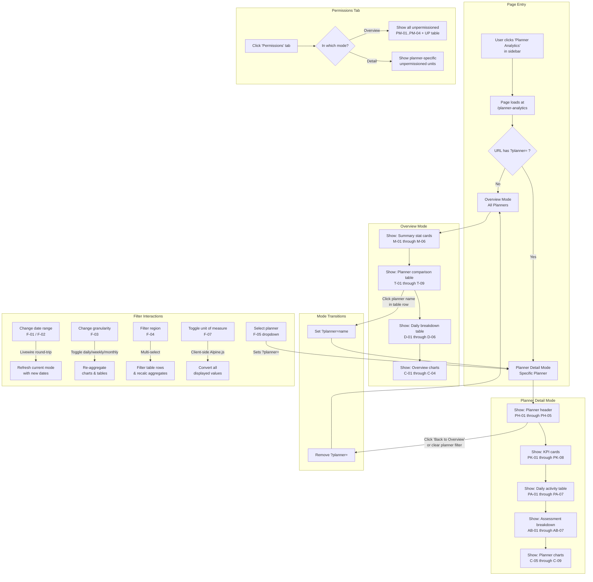
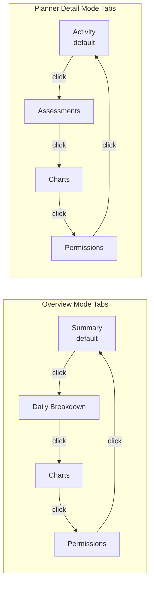
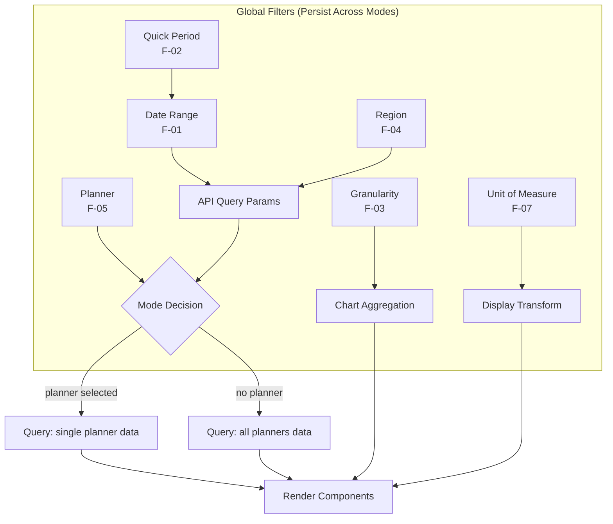
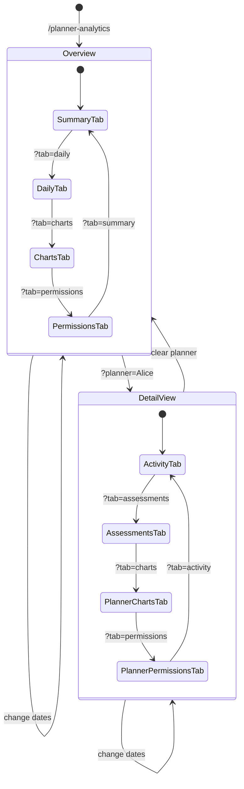
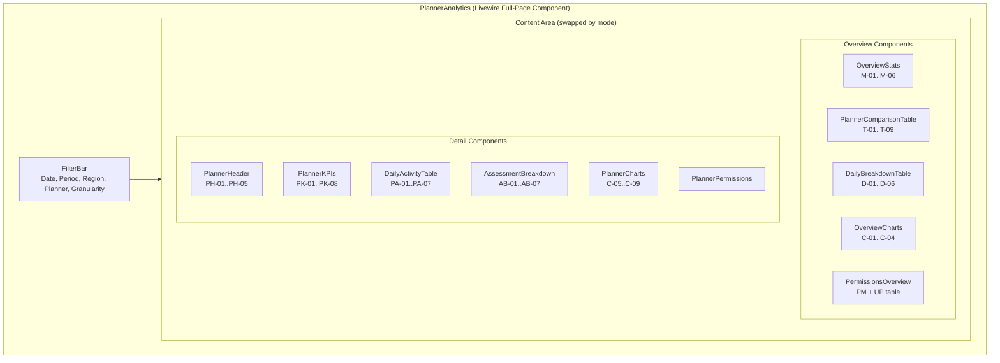

# Planner Analytics Page — User Flow Chart

> **Created:** 2026-02-10
> **Status:** DRAFT

---

## Primary User Flow



---

## Tab Navigation Flow



---

## Filter Cascade Flow



---

## URL State Machine



---

## Component Architecture



---

## Interaction Patterns

### Click Planner Name (Overview -> Detail)
```
1. User clicks "Alice Johnson" in comparison table
2. Livewire sets $selectedPlanner = "Alice Johnson"
3. URL updates: ?planner=Alice+Johnson
4. Content area transitions (optional: Alpine.js fade)
5. Planner detail components mount with Alice's data
6. Charts render with Alice's historical data
```

### Change Date Range
```
1. User picks new dates in date picker
2. Livewire property updates ($dateFrom, $dateTo)
3. URL updates: ?from=2026-01-06&to=2026-01-12
4. All visible components re-query with new dates
5. Charts re-render with new data range
6. Loading states shown during fetch
```

### Switch Tab
```
1. User clicks "Charts" tab
2. Alpine.js tab component shows charts pane
3. URL updates: ?tab=charts
4. If chart data not yet loaded, Livewire fetches it
5. Chart.js renders in the visible container
```

---

*Generated by BMad Master — Planner Analytics User Flow*
