# Planner Daily Activity — Business Rules & Constraints

> **Purpose:** Formalize all business rules for station/unit attribution before implementation.
> **Status:** Draft — Review and adjust as needed.

---

## Table of Contents

1. [Domain Glossary](#1-domain-glossary)
2. [Station Completion Rules](#2-station-completion-rules)
3. [Unit Classification](#3-unit-classification)
4. [Footage Attribution Logic](#4-footage-attribution-logic)
5. [Data Quality Flags](#5-data-quality-flags)
6. [Query Constraints](#6-query-constraints)
7. [Date & Time Rules](#7-date--time-rules)
8. [Chunking Strategy](#8-chunking-strategy)
9. [Edge Cases](#9-edge-cases)
10. [Open Questions](#10-open-questions)

---

## 1. Domain Glossary

| Term | Definition |
|------|------------|
| **Circuit** | A powerline route belonging to a region (1-120+ miles) |
| **Assessment** | A planning job for a circuit's vegetation maintenance (`JOBGUID` + `WO` + `EXT`) |
| **Station** | A span between two poles; identified by `STATNAME`; length in meters via `SPANLGTH` |
| **Unit** | A work item placed at a station by a planner; tracked in `VEGUNIT` table |
| **Planner/Forester** | The user who creates units; stored in `VEGUNIT.FORESTER` (display name) or `VEGUNIT.FRSTR_USER` (username) |
| **Footage** | The length of a station's span; credited to the planner who places the first unit |
| **Work Unit** | A unit representing actual vegetation work (trimming, removal, etc.) |
| **Non-Work Unit** | A unit that marks a station complete but isn't billable work (`NW`, `NOT`, `SENSI`) |

---

## 2. Station Completion Rules

### 2.1 First Unit Wins (Footage Attribution)

```
RULE: The planner who creates the FIRST unit in a station gets 100% of that station's footage credit.
```

- **First** is determined by: `ORDER BY ASSDDATE ASC, EDITDATE ASC`
- Footage credit is assigned to the **date** of the first unit (`ASSDDATE`)
- The **planner** is the `FORESTER` field of that first unit

### 2.2 One-Time Credit

```
RULE: A station's footage is credited ONLY ONCE — on the date its first unit was created.
```

- Even if 50 more units are added later, the footage was already credited on Day 1
- Later units contribute to **unit counts** only, not footage

### 2.3 Multi-Planner Stations

```
RULE: If Planner B adds units to a station that Planner A started:
  - Planner A gets: footage credit (on their date)
  - Planner B gets: unit counts only (on their dates)
```

**Example:**
| Date | Planner | Unit | Gets Footage? | Gets Unit Count? |
|------|---------|------|---------------|------------------|
| 01-15 | Alice | SPM | ✅ Yes (first) | ✅ Yes |
| 01-16 | Alice | SPB | ❌ No | ✅ Yes |
| 01-17 | Bob | REM612 | ❌ No | ✅ Yes |

### 2.4 Station Counting

```
RULE: Each station is counted ONCE per planner — on the date of their first unit in that station.
```

- If Alice places 3 units in Station 10 on the same day → 1 completed station for Alice
- If Alice places units in Station 10 on Day 1 and Day 2 → Station counted on Day 1 only

---

## 3. Unit Classification

### 3.1 Work Units (Count as Units + Footage)

These represent actual vegetation management work:

| Code | Description |
|------|-------------|
| `SPM` | Single Phase Manual trim |
| `SPB` | Single Phase Bucket trim |
| `MPM` | Multi Phase Manual trim |
| `MPB` | Multi Phase Bucket trim |
| `REM612` | Removal 6-12 inch |
| `REM1218` | Removal 12-18 inch |
| `REM1824` | Removal 18-24 inch |
| `REM2430` | Removal 24-30 inch |
| `REM3036` | Removal 30-36 inch |
| `ASH612` | Ash Removal 6-12 inch |
| `ASH1218` | Ash Removal 12-18 inch |
| `ASH1824` | Ash Removal 18-24 inch |
| `ASH2430` | Ash Removal 24-30 inch |
| `ASH3036` | Ash Removal 30-36 inch |
| `VPS` | Vegetation Problem Site |
| `BRUSH` | Brush clearing |
| `HCB` | Hand Cut Brush |
| `BRUSHTRIM` | Hand Cut Brush with Trim |
| `HERBA` | Herbicide Aquatic |
| `HERBNA` | Herbicide Non-Aquatic |
| *(others)* | Any unit code not in non-work list |

### 3.2 Non-Work Units (Footage Only, No Unit Count)

These mark a station as assessed but don't represent billable work:

| Code | Description | Config Key |
|------|-------------|------------|
| `NW` | No Work needed | `non_work_units` |
| `NOT` | Notification point (for notes) | `non_work_units` |
| `SENSI` | Sensitive customer marker | `non_work_units` |

```php
// config/ws_assessment_query.php
'non_work_units' => ['NW', 'NOT', 'SENSI'],
```

### 3.3 Excluded Values (Neither Footage nor Unit)

| Value | Reason |
|-------|--------|
| `NULL` | Station not yet assessed |
| `''` (empty string) | Station not yet assessed |

---

## 4. Footage Attribution Logic

### 4.1 Attribution Decision Tree

```
FOR EACH station in assessment:
  │
  ├─ Does station have ANY units with UNIT not NULL/empty?
  │   │
  │   ├─ NO → Station excluded (not planned yet)
  │   │
  │   └─ YES → Find FIRST unit (ORDER BY ASSDDATE, EDITDATE)
  │       │
  │       ├─ First unit's FORESTER matches query planner?
  │       │   │
  │       │   ├─ YES → Credit footage to this planner on first unit's date
  │       │   │
  │       │   └─ NO → Add to "stations_by_outside_planners" count
  │       │
  │       └─ Is first unit a work unit or non-work unit?
  │           │
  │           ├─ WORK UNIT → Also count as unit for that planner
  │           │
  │           └─ NON-WORK → Footage only, no unit count
```

### 4.2 SQL Pattern for First-Unit Detection

```sql
WITH RankedUnits AS (
    SELECT
        VEGUNIT.*,
        ROW_NUMBER() OVER (
            PARTITION BY VEGUNIT.JOBGUID, VEGUNIT.STATNAME
            ORDER BY VEGUNIT.ASSDDATE ASC, VEGUNIT.EDITDATE ASC
        ) AS unit_rank
    FROM VEGUNIT
    WHERE VEGUNIT.UNIT IS NOT NULL
      AND VEGUNIT.UNIT != ''
)
SELECT * FROM RankedUnits WHERE unit_rank = 1
-- This gives us the first unit per station per assessment
```

### 4.3 Measurement Conversions

| From | To | Formula |
|------|----|---------|
| Meters | Feet | `meters * 3.28084` |
| Meters | Miles | `meters / 1609.34` |
| Feet | Miles | `feet / 5280` |

---

## 5. Data Quality Flags

### 5.1 Invalid Combinations

| Flag Code | Condition | Severity | Action |
|-----------|-----------|----------|--------|
| `nw_with_work_unit` | Station has `NW` AND a work unit | Warning | Flag for correction |

**Why it's invalid:** `NW` means "No Work" — if there's also a work unit, one of them is wrong.

### 5.2 Valid Combinations

| Combination | Valid? | Reason |
|-------------|--------|--------|
| `NW` alone | ✅ | No work needed |
| `NOT` alone | ✅ | Notification point only |
| `SENSI` alone | ✅ | Sensitive customer marker |
| `NW` + `NOT` | ✅ | No work, but has notification |
| `NW` + `SENSI` | ✅ | No work, sensitive customer |
| `NOT` + `SENSI` | ✅ | Both markers, no conflict |
| `NW` + `SPM` | ❌ | Contradictory |
| `SPM` + `SPB` | ✅ | Multiple work types in same station |

---

## 6. Query Constraints

### 6.1 Config-Driven Filters

| Config Key | Purpose | Applied To |
|------------|---------|------------|
| `contractors` | Filter by contractor | `VEGJOB.CONTRACTOR` |
| `job_types` | Include only assessment types | `SS.JOBTYPE` |
| `cycle_types` | Exclude reactive/storm work | `VEGJOB.CYCLETYPE NOT IN` |
| `excludedUsers` | Exclude system/test accounts | `VEGUNIT.FORESTER NOT IN` |
| `scope_year` | Filter by work program year | `WPStartDate_Assessment_Xrefs` |
| `non_work_units` | Define non-work unit codes | Unit classification logic |

### 6.2 Assessment Status Filter

Only include assessments with status in `['ACTIV', 'QC', 'REWRK', 'CLOSE']`

### 6.3 Station Name Rules

| Pattern | Meaning | Include in Results? |
|---------|---------|---------------------|
| `10`, `20`, `30`... | Normal work stations (multiples of 10) | ✅ Yes |
| `EX...` prefix | Excluded station with non-work only | Separate count (`total_nw_stations`) |
| `EX...` with work unit | Data quality issue | Flag it |

---

## 7. Date & Time Rules

### 7.1 Date Fields

| Field | Table | Format | Purpose |
|-------|-------|--------|---------|
| `ASSDDATE` | VEGUNIT | MS JSON Date | When unit was assessed (primary) |
| `EDITDATE` | VEGUNIT | MS JSON Date | When unit was last modified |
| `EDITDATE` | SS | MS JSON Date | Assessment last sync |

### 7.2 Week Boundaries

- **Week Start:** Sunday
- **Week End:** Saturday (this is `week_ending_date`)
- **Weekly Quota:** 6.5 miles (measured Sun-Sat)

### 7.3 Default Date Behavior

```
IF BOTH $dates AND $planner are NULL:
    1. Try current date
    2. If no results, retry with (current date - 1)
    3. Continue until results found or limit reached (max 7 retries)

IF only $dates is NULL (but $planner is provided):
    → Require explicit date parameter OR return validation error
```

### 7.4 Date Input Formats

| Input | Interpretation |
|-------|----------------|
| `'01-21-2026'` | Single day |
| `['01-21-2026', '01-31-2026']` | Date range (inclusive) |
| `null` | Current date with retry logic |

---

## 8. Chunking Strategy

### 8.1 When to Chunk

| Condition | Chunk? | Reason |
|-----------|--------|--------|
| Single planner, single date | ❌ No | Small dataset |
| Single planner, ≤7 days | ❌ No | Manageable |
| Single planner, >7 days | ✅ Yes | Could be large |
| No planner filter, any range | ✅ Yes | All planners = large |
| Planner set, no date (full history) | ✅ Yes | Very large |

### 8.2 Chunk Size

- **7 days** per chunk
- **Boundaries:** Sunday through Saturday
- **Merge:** Results combined after all chunks complete

### 8.3 Queue Implementation

```php
// Pseudo-code
if (shouldChunk($planner, $dates)) {
    $chunks = splitIntoWeeklyChunks($dates);
    foreach ($chunks as $chunk) {
        ProcessPlannerActivityChunk::dispatch($planner, $chunk);
    }
    // Results merged via job completion handler
}
```

---

## 9. Edge Cases

### 9.1 Same Station, Same Day, Same Planner, Multiple Units

**Scenario:** Alice places 5 units in Station 10 on 01-15

**Result:**
- Footage: Credit Station 10's footage once to 01-15
- Stations: Count as 1 completed station
- Units: Count all 5 work units

### 9.2 Same Station, Same Day, Different Planners

**Scenario:** Alice places unit at 9:00 AM, Bob places unit at 2:00 PM in Station 10 on 01-15

**Result:**
- Alice gets footage (first unit by ASSDDATE + EDITDATE)
- Both get their unit counts
- Station counted once (for Alice's metrics)

### 9.3 Planner Works Multiple Assessments Same Day

**Scenario:** Alice works Assessment A (2 miles) and Assessment B (1.5 miles) on 01-15

**Result:**
- Daily total: 3.5 miles (sum of both assessments)
- Response shows breakdown per assessment

### 9.4 Station Spans Multiple Days (First Unit Logic)

**Scenario:** Alice places NW on 01-15, then SPM on 01-16 in same station

**Result:**
- Footage credited to 01-15 (when NW was placed — first unit wins)
- SPM unit counted on 01-16 for Alice
- No additional footage on 01-16

### 9.5 Zero Results Day

**Scenario:** Query for 01-20 returns no activity

**Result:**
- If `$dates` was explicit: Return empty result for that day
- If `$dates` was null (default): Retry previous day

### 9.6 Planner Name Formats

**Scenario:** Query uses `'Toni Gibson'` but DB has `'ASPLUNDH\tgibson'`

**Result:**
- Check both `FORESTER` (username) and `FRSTR_USER` (display name) fields
- Case-insensitive matching recommended

---

## 10. Open Questions

> **Review these and update the document as decisions are made.**

| # | Question | Status | Decision |
|---|----------|--------|----------|
| 1 | Should `EDITDATE` changes on existing units trigger re-attribution? | ❓ Open | |
| 2 | What's the retry limit for null date fallback? | ❓ Open | Suggest: 7 days max |
| 3 | Should we track "adjusted" footage for audited/failed units? | ❓ Open | |
| 4 | Are there other non-work unit codes beyond NW/NOT/SENSI? | ❓ Open | Can add to config |
| 5 | Should stations with ONLY `EX` prefix be in a separate bucket? | ❓ Open | Currently: yes |

---

---

## 11. Data Flow Diagrams

### 11.1 Station Footage Attribution Flow

```mermaid
flowchart TD
    subgraph INPUT["📥 Input"]
        A[Query Request] --> B{Planner specified?}
        B -->|Yes| C[Filter by FORESTER/FRSTR_USER]
        B -->|No| D[All planners]
        C --> E{Date specified?}
        D --> E2{Date specified?}
        E -->|Yes| F[Use provided date/range]
        E -->|No| F2[Require date param<br/>or validation error]
        E2 -->|Yes| F
        E2 -->|No| G[Use current date<br/>retry -1 if empty]
        F --> H[Fetch VEGUNIT + STATIONS]
        F2 --> H
        G --> H
    end

    subgraph PROCESS["⚙️ First Unit Detection"]
        H --> I[Group units by<br/>JOBGUID + STATNAME]
        I --> J[ORDER BY ASSDDATE, EDITDATE]
        J --> K[ROW_NUMBER = 1<br/>is First Unit]
        K --> L{First unit's<br/>FORESTER matches<br/>query planner?}
    end

    subgraph ATTRIBUTE["📊 Attribution"]
        L -->|Yes| M[✅ Credit footage<br/>to this planner]
        L -->|No| N[➕ Add to<br/>outside_planners count]
        M --> O{Unit type?}
        O -->|Work Unit| P[✅ Count as unit<br/>+ footage]
        O -->|Non-Work<br/>NW/NOT/SENSI| Q[✅ Footage only<br/>no unit count]
        O -->|NULL/Empty| R[❌ Excluded]
    end

    subgraph OUTPUT["📤 Output Structure"]
        P --> S[Aggregate by<br/>planner → date → assessment]
        Q --> S
        N --> S
        S --> T{groupBy param?}
        T -->|planner-assessment-date| U[Response A:<br/>Drill-down view]
        T -->|planner-date-assessments| V[Response B:<br/>Timeline view]
    end
```



### 11.2 Unit Classification Flow

```mermaid
flowchart LR
    subgraph UNIT_INPUT["Unit Record"]
        A[VEGUNIT.UNIT value]
    end

    subgraph CLASSIFY["Classification"]
        A --> B{Value?}
        B -->|NULL or empty| C[❌ EXCLUDED<br/>Station not planned]
        B -->|NW, NOT, SENSI| D[📋 NON-WORK UNIT<br/>Footage: ✅<br/>Unit Count: ❌]
        B -->|SPM, SPB, REM612,<br/>BRUSH, etc.| E[🔧 WORK UNIT<br/>Footage: ✅<br/>Unit Count: ✅]
    end

    subgraph SPECIAL["Special Cases"]
        D --> F{Station has<br/>NW + Work Unit?}
        F -->|Yes| G[⚠️ DATA QUALITY FLAG<br/>nw_with_work_unit]
        F -->|No| H[✅ Valid]
    end
```



### 11.3 Station Lifecycle (Single Station Example)

```mermaid
sequenceDiagram
    participant S as Station 10<br/>(500m span)
    participant A as Alice
    participant B as Bob
    participant DB as Database
    participant M as Metrics

    Note over S: Station EMPTY<br/>No units yet

    A->>S: Places NW unit (01-15 9:00 AM)
    S->>DB: UNIT='NW', FORESTER='Alice'<br/>ASSDDATE='01-15'
    DB->>M: Station 10 → Alice<br/>Footage: 500m ✅<br/>Unit: 0 (NW)

    Note over S: Station COMPLETE<br/>First unit wins

    A->>S: Places SPM unit (01-15 2:00 PM)
    S->>DB: UNIT='SPM', FORESTER='Alice'<br/>ASSDDATE='01-15'
    DB->>M: Alice +1 unit<br/>Footage: already credited

    B->>S: Places REM612 (01-16 10:00 AM)
    S->>DB: UNIT='REM612', FORESTER='Bob'<br/>ASSDDATE='01-16'
    DB->>M: Bob +1 unit<br/>Footage: ❌ (Alice owns station)

    Note over M: Final Tally:<br/>Alice: 500m footage, 1 unit<br/>Bob: 0m footage, 1 unit
```



### 11.4 Weekly Aggregation Flow

```mermaid
flowchart TD
    subgraph DAILY["Daily Activity (per planner)"]
        D1[Mon: 1.2 mi]
        D2[Tue: 0.8 mi]
        D3[Wed: 1.5 mi]
        D4[Thu: 0 mi]
        D5[Fri: 2.1 mi]
        D6[Sat: 0.9 mi]
        D7[Sun: 0 mi]
    end

    subgraph WEEKLY["Weekly Summary"]
        D1 --> W[Week Total:<br/>6.5 miles]
        D2 --> W
        D3 --> W
        D4 --> W
        D5 --> W
        D6 --> W
        D7 --> W
        W --> Q{vs Quota<br/>6.5 mi/week}
        Q -->|≥ 6.5| G[✅ Quota Met]
        Q -->|< 6.5| R[⚠️ Below Quota]
    end

    subgraph CONTEXT["Week Context"]
        WE[week_ending_date:<br/>Saturday]
        WE -.-> W
    end
```



### 11.5 Query Chunking Flow

```mermaid
flowchart TD
    subgraph REQUEST["Incoming Request"]
        A[getDailyActivity<br/>planner, dates] --> B{Needs chunking?}
    end

    subgraph DECIDE["Chunking Decision"]
        B -->|Single date| C[❌ No chunk<br/>Direct query]
        B -->|≤7 days + planner| C
        B -->|>7 days| D[✅ Chunk needed]
        B -->|No planner filter| D
        B -->|Full history| D
    end

    subgraph CHUNK["Chunk Processing"]
        D --> E[Split into<br/>7-day windows<br/>Sun → Sat]
        E --> F[Dispatch Queue Jobs]
        F --> G[Job 1: Week 1]
        F --> H[Job 2: Week 2]
        F --> I[Job N: Week N]
        G --> J[Merge Results]
        H --> J
        I --> J
    end

    subgraph DIRECT["Direct Query"]
        C --> K[Single API call]
        K --> L[Return response]
    end

    J --> L
```



---

## Revision History

| Date | Author | Changes |
|------|--------|---------|
| 2026-02-02 | BMAD/Lyra | Initial draft |
| 2026-02-02 | BMAD | Added Mermaid data flow diagrams |

